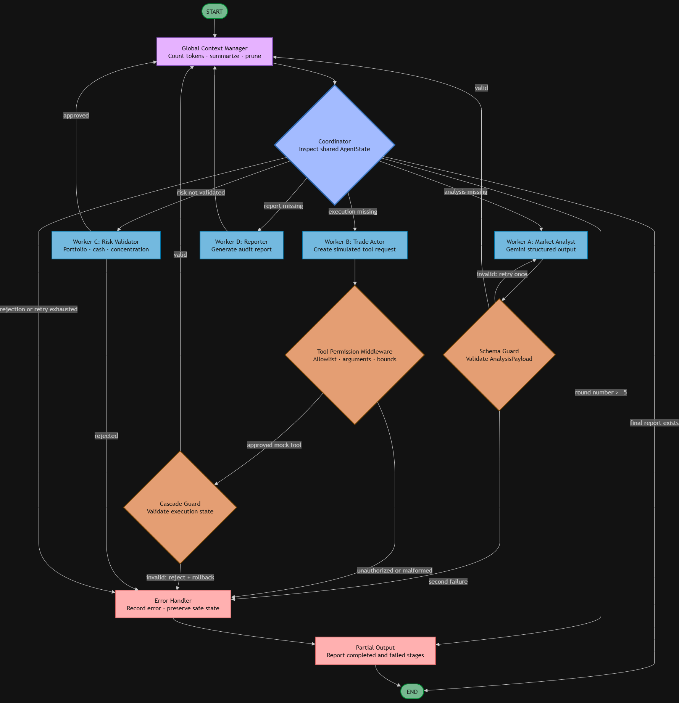

# System Design

## Architecture and Rationale

Financial recommendations are high-stakes, structurally constrained, and easy
to audit, making this domain useful for demonstrating agent failure containment.
One deterministic Coordinator routes a shared Pydantic AgentState through four
workers: Market Analyst, Trade Actor, Risk/Compliance Validator, and Reporter.
Global context and privacy interceptors operate at trust boundaries. Tool calls
are approved list in-memory simulations. Errors go to a partial-output path, so
the graph terminates without losing the original task or successful state.

The contract is frozen in `contract.py`; `extra="forbid"` prevents silent state
drift. The implementation uses a bounded LangGraph state machine with explicit
nodes and conditional edges. Safety does not depend on model judgment.

### Frozen Graph Design Tree

[Link to Diagram (open with Draw.io)](https://drive.google.com/file/d/1g5GMa8icj9A-rzcTMI2jCZr5EUy7J465/view?usp=sharing)

The Context Manager executes before every Coordinator transition, including
retry loops. Schema and cascade guards are explicit boundary nodes and do not
consume the five-round Worker budget. Every Worker output is redacted before it
becomes the next LangGraph state, preventing automatic LangSmith tracing from
observing unredacted state. The synchronous CLI uses `invoke`; an equivalent
`ainvoke` entry point supports asynchronous integration without changing the
shared contract.

### Contract and Graph Freeze

The first repository commit contains `contract.py`, `requirements.txt`,
`.env.example`, and `.gitignore`. That establishes the universal Pydantic state
before individual guardrail implementation. This document records the frozen
Coordinator, four-Worker topology, guard-node placement, recovery routes, and
global layers. 

## Six Primary Failure Modes and Mitigations

1. **Infinite Graph Loop:** a five-round counter routes to partial output.
2. **Silent Hallucination/Structure Failure:** constrained Pydantic models reject
   missing and impossible values, with at most one retry.
3. **Rogue Tool Execution:** middleware validates tool name, exact arguments,
   types, quantity, and theoretical before invoking only mock functions.
4. **Downstream Cascade:** a boundary model rejects malformed execution data
   before arithmetic and marks rollback/rejection state.
5. **Telemetry Privacy Leak:** recursive key and regex redaction occurs before
   any external telemetry payload is formed.
6. **Context Explosion:** deterministic counting, summary, redundant-history
   removal, and recent-message retention enforce a 2,000-token demo budget.

Deterministic guardrails were chosen over prompt-only safety because prompts are
probabilistic and can be ignored, injected, or malformed. Code checks are
repeatable, testable, measurable, and fail closed.

## Nineteen Additional Risks Considered

| Risk | Potential Impact | Possible Mitigation | Why Not a Primary Guardrail |
|---|---|---|---|
| Stale market price | Bad recommendation | Timestamp and maximum-age check | Demo adapter has no market clock requirement |
| Duplicate trade intent | Repeated simulated order | Idempotency key and intent ledger | One action is created per run |
| Non-idempotent retry | Double side effect | Idempotent tool tokens | Tools are side-effect-free mocks |
| Portfolio race condition | Incorrect concentration | Versioned state/transaction lock | CLI is single-run and single-threaded |
| Malformed ticker | Wrong lookup | Symbol regex and canonicalization | Already partly covered by supported set |
| Unsupported asset | Contract mismatch | Asset-type allowlist | Product intentionally supports equities only |
| Excessive position size | Concentration loss | Quantity/notional/concentration limits | Covered within risk validation, not standalone |
| Stale Coordinator state | Wrong route | State version and checkpoint validation | No distributed checkpoints in this build |
| Tool timeout | Hung workflow | Timeout/circuit breaker | Mock tools are local and immediate |
| Contradictory outputs | Incoherent report | Cross-agent consistency rules | One authoritative analysis payload |
| Retry storm | Cost and latency | Global retry budget/backoff | One-retry and round guards already contain it |
| Prompt injection | Safety bypass | Input separation/content filters | Model cannot authorize tools or routing |
| Audit log tampering | Lost evidence | Append-only signed events | Local educational audit only |
| Timestamp mismatch | Incorrect sequencing | UTC timestamps and skew check | No time-sensitive trade placement occurs |
| Malformed JSON | Parsing crash | Structured parser and repair | Included within schema failure family |
| Confidence calibration | Misleading certainty | Calibration dataset/threshold | Requires strategy evaluation beyond rubric |
| Market-session mismatch | Invalid timing assumption | Exchange calendar check | No actual orders can be placed |
| Corrupted checkpoint | Unrecoverable state | Schema/version/checksum | Runtime does not persist checkpoints |
| Model/provider outage | Missing analysis | Circuit breaker and fallback | Implemented as resilience, not assigned primary |

## Reliability, Observability, and Recovery

Market calls use an eight-second timeout, HTTP validation, error detection, and
explicit fallback source labels. Gemini errors are captured and fall back to a
deterministic analysis. Routing has a global round bound and retry bound. The
Reporter has no tools. Only `redact_for_telemetry(state)` can construct trace
payloads; raw demonstration secrets are printed locally only as counts.

## Portfolio Rules

The simulated portfolio starts with $100,000 cash and AAPL/MSFT/NVDA positions.
The validator enforces supported symbol, integer quantity 0–100, action/quantity
consistency, $10,000 maximum concept, cash sufficiency, available holdings for
sells, valid schema risk range, positive price, and 20% post-trade concentration.

## Measured Verification

The six deterministic tests reduced loop iterations 100→5, invalid accepted
payloads 2→0, unauthorized executions 1→0, downstream crashes 1→0, exposed
sensitive values 5→0, and estimated context tokens 17,281→1,765. All tests
terminate without external financial action.
